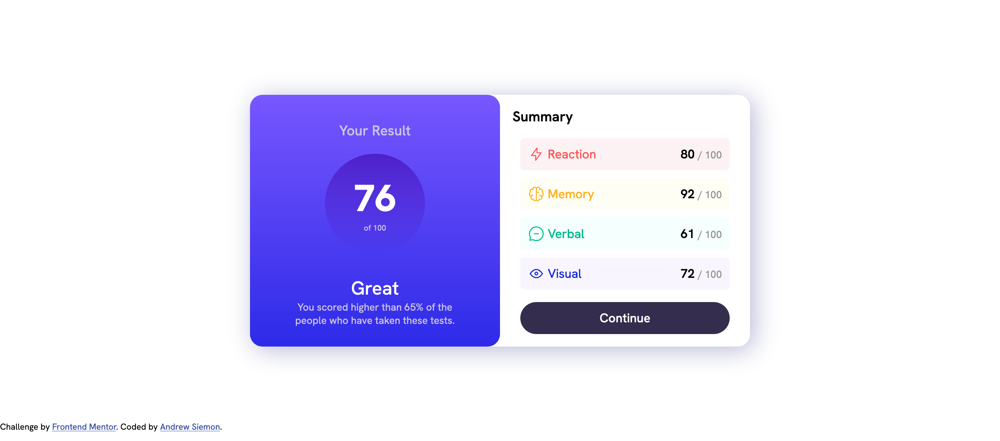

# Frontend Mentor - Results summary component solution

This is a solution to the [Results summary component challenge on Frontend Mentor](https://www.frontendmentor.io/challenges/results-summary-component-CE_K6s0maV). Frontend Mentor challenges help you improve your coding skills by building realistic projects.

## Table of contents

- [Overview](#overview)
  - [The challenge](#the-challenge)
  - [Screenshot](#screenshot)
  - [Links](#links)
- [My process](#my-process)
  - [Built with](#built-with)
  - [What I learned](#what-i-learned)
  - [Continued development](#continued-development)
  - [Useful resources](#useful-resources)
- [Author](#author)

## Overview

### The challenge

Users should be able to:

- View the optimal layout for the interface depending on their device's screen size
- See hover and focus states for all interactive elements on the page

### Screenshot



### Links

- Solution URL: https://github.com/sandr15/Results-Summary-Component
- Live Site URL: https://sandr15.github.io/Results-Summary-Component/

## My process

### Built with

- HTML5
- CSS
- Flexbox

### What I learned

1. Load custom fonts with the @font-face CSS at-rule.

2. Use media queries to apply CSS rules based on the screen size.

3. The concept of a "font stack". When specifying the font-family for
a page, you can supply multiple font names. The browser will attempt to use
the first font specified, but can fall back to the next specified font if the
current font cannot be applied. You can specify as many fonts as you want; generally with more universal fonts appearing at the bottom of your stack.

*Code demonstrating a font stack:*
```css
body {
  font-family: 'Hanken Grotesk', sans-serif;
}
```

4. CSS layout with flexbox and positioning. Flexbox makes it simple to layout
the elements on your page in a single dimension (i.e. horizontally or
vertically). Positioning, on the other hand, allows you to remove elements
from the normal document flow. I used flexbox extensively to lay out the
elements in the main modal, and I used positioning to fix the modal to the
center of the display (for desktop displays).

*Code to position the modal in the center of the screen:*
```css
.result-summary-modal {
    position: fixed;
    top: 50%;
    left: 50%;
    translate: -50% -50%;
}
```

### Continued development

1. Gain experience using CSS grid layout / practice more layouts.

2. Transition from pure CSS to SASS.

3. Practice React skills by creating this design with JSX.

### Useful resources

- [How to Load and Use Custom Fonts with CSS](https://www.digitalocean.com/community/tutorials/how-to-load-and-use-custom-fonts-with-css#loading-a-self-hosted-font-with-font-face) - This helped me learn how to use the `@font-face` at-rule. This will make it incredibly easy to incorporate more fonts into future projects.
- [Border Radius in Percentage vs Pixels](https://stackoverflow.com/questions/29966499/border-radius-in-percentage-and-pixels-px-or-em) - This helped me learn how to create a *stadium* shape for a button. At first, I
attempted to create the shape using percentage values. This post helped me to
figure out where I was going wrong.

## Author

- Andrew Siemon - [Frontend Mentor Profile](https://www.frontendmentor.io/profile/sandr15)
